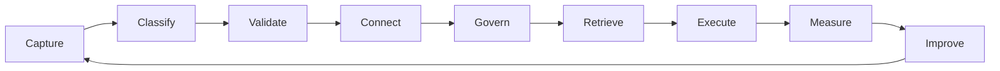

# Master Enterprise Ontology

## Purpose

Create a shared language for the AI-enabled enterprise.

## Canonical chain

```text
Vision -> Outcomes -> Strategy -> Capabilities -> Value Streams -> Processes -> Workflows -> Tasks -> Knowledge -> AI Agents -> Metrics -> Learning
```

## Core object types

| Object | Definition | Example |
|---|---|---|
| Vision | Desired future state | Become the operating system for AI enterprises |
| Outcome | Measurable business result | Reduce cycle time by 35% |
| Strategy | Coherent choices and tradeoffs | Prioritize regulated mid-market enterprises |
| Capability | Enterprise ability | AI governance, sales execution, customer onboarding |
| Value Stream | End-to-end flow that creates value | Lead-to-cash, issue-to-resolution |
| Process | Repeatable operating process | Weekly business review |
| Workflow | Executable sequence | Collect KPI data, detect variance, assign action |
| Task | Unit of work | Send follow-up email |
| Knowledge | Governed context | SOP, policy, transcript, decision log |
| AI Agent | AI role within guardrails | Sales discovery assistant |
| Metric | Measurement object | Win rate, cycle time, gross retention |
| Learning | Feedback loop | What changed after execution |

## Knowledge River



## OperOS implementation path

1. Inventory current knowledge sources.
2. Map knowledge to ontology objects.
3. Identify missing owners, versions, and dependencies.
4. Convert critical assets into governed knowledge objects.
5. Connect the objects to workflows, metrics, and AI agents.
6. Build continuous feedback loops.
