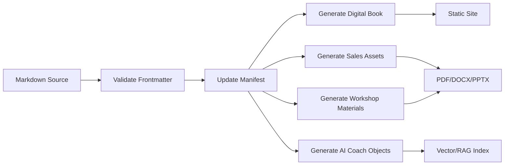

# Publishing Pipeline

## Purpose

Automate conversion of OperOS source objects into market-facing and implementation-ready assets.

## Pipeline

## Validation checks

- object ID exists
- version exists
- status valid
- dependencies exist
- required framework sections present
- no unsupported claims
- no copied source material
- publishing targets defined

## Release process

1. Draft object.
2. Validate schema.
3. Update manifest.
4. Generate outputs.
5. QA outputs.
6. Create release bundle.
7. Publish.
8. Capture feedback.
9. Update source.
